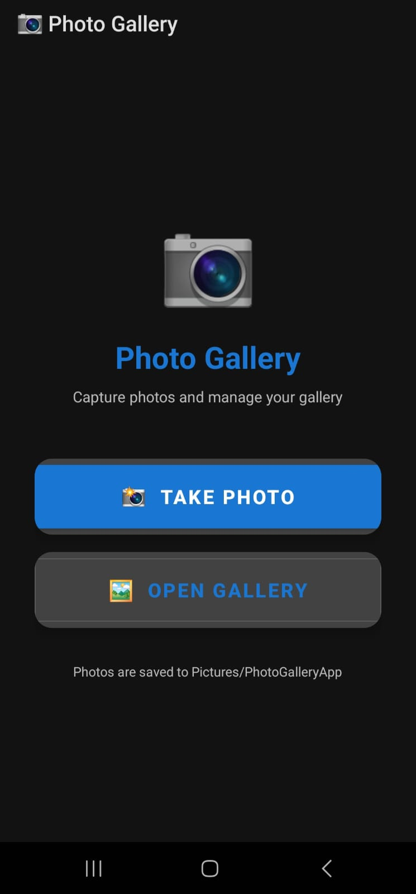
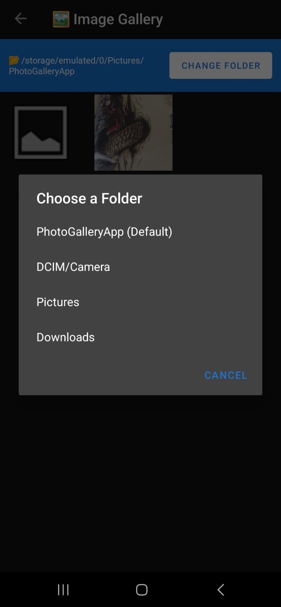
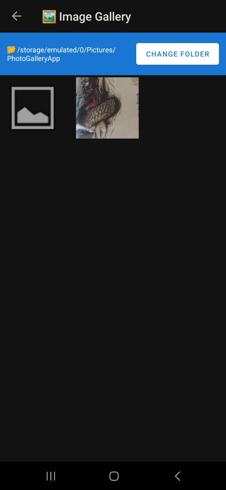
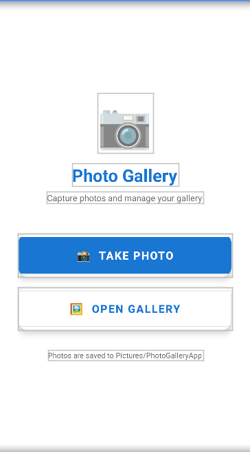
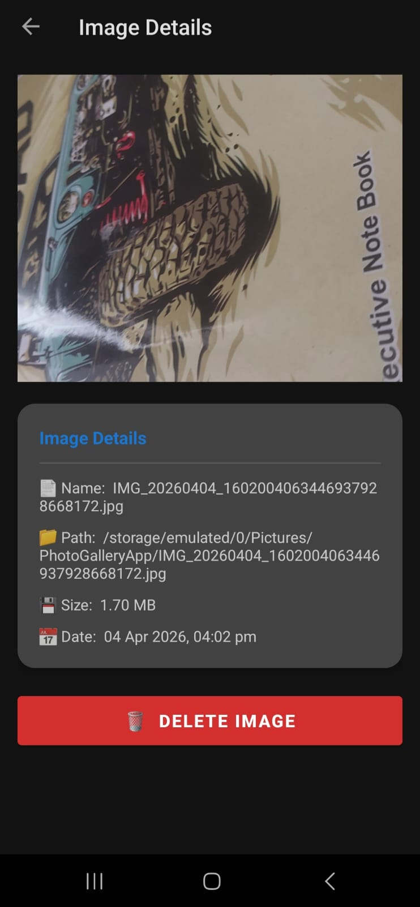

# Q4 — Photo Gallery App

## About
This is my fourth Android project for the Mobile Application Development assignment (CSE3709). In this project I made a complete photo gallery app where you can take photos from the camera, view them in a folder as a grid, and also delete them with a confirmation popup.

---

## Screenshots

### Home Screen


### Folder Selection


### Image Grid (Gallery View)


### Image Detail Screen


### Delete Confirmation Dialog


---

## What I Made

The app has three main screens:

**Home Screen** — Two buttons, one to open the camera and take a photo, and one to open the gallery to browse images.

**Gallery Screen** — Shows all images from the selected folder in a 3 column grid, just like a normal photo gallery app. There is also a Change Folder button so you can browse images from Camera, Pictures, Downloads or any other folder.

**Image Detail Screen** — When you tap on any image it opens this screen. It shows the full image preview and all the details like file name, full path, size in KB or MB, and the date the photo was taken. There is a Delete button at the bottom which shows a confirmation dialog before deleting.

---

## What I Used

- Java (Android)
- XML for all UI layouts
- 3 Activities — MainActivity, GalleryActivity, ImageDetailActivity
- Camera Intent using MediaStore.ACTION_IMAGE_CAPTURE to open the camera
- FileProvider to share the image file URI with the camera app (required from Android 7+)
- GridView with a custom BaseAdapter called ImageGridAdapter for the photo grid
- BitmapFactory with inSampleSize for loading thumbnails without crashing
- AlertDialog for the delete confirmation popup
- File class to read image metadata like name, size, and last modified date
- Runtime permission handling for Camera and Storage
- MediaScanner broadcast so new photos appear in the system gallery immediately
- SharedPreferences not needed here since no settings to save

---

## How the App Works

**Taking a Photo:**
1. User taps Take Photo button
2. App checks if camera and storage permissions are granted, if not it asks for them
3. App creates a new file in Pictures/PhotoGalleryApp/ folder with a timestamp name like IMG_20240401_143022.jpg
4. Gets a content URI from FileProvider and passes it to the camera
5. Camera opens, user takes photo, it saves to that file automatically
6. After returning, app sends a MediaScanner broadcast so the photo appears in system gallery too

**Viewing Gallery:**
1. User taps Open Gallery
2. GalleryActivity opens and loads all images from Pictures/PhotoGalleryApp/ by default
3. Images show in a 3 column grid as thumbnails
4. User can tap Change Folder to pick from Camera, Pictures, Downloads etc.
5. Empty message shown if folder has no images

**Image Details and Delete:**
1. User taps any image in the grid
2. ImageDetailActivity opens with full image preview
3. Details shown — name, full path, size, date taken
4. User taps Delete button
5. Confirmation dialog appears asking "Are you sure?"
6. If yes — file gets deleted and app goes back to gallery
7. Gallery reloads automatically and the deleted image is gone

---

## Project Structure

```
PhotoGallery/
└── app/
    └── src/
        └── main/
            ├── java/com/example/photogallery/
            │   ├── MainActivity.java         ← Home screen, camera logic, permissions
            │   ├── GalleryActivity.java      ← Grid view, folder selection
            │   ├── ImageGridAdapter.java     ← Custom adapter for GridView
            │   └── ImageDetailActivity.java  ← Image details + delete
            │
            ├── res/
            │   ├── layout/
            │   │   ├── activity_main.xml
            │   │   ├── activity_gallery.xml
            │   │   └── activity_image_detail.xml
            │   ├── values/
            │   │   ├── themes.xml
            │   │   ├── colors.xml
            │   │   └── strings.xml
            │   └── xml/
            │       └── file_paths.xml        ← Required for FileProvider
            │
            └── AndroidManifest.xml
```

---

## Permissions Used

| Permission | Why |
|---|---|
| CAMERA | To open the camera and take photos |
| READ_EXTERNAL_STORAGE | To read images from device storage (Android 12 and below) |
| WRITE_EXTERNAL_STORAGE | To save photos to external storage (Android 9 and below) |
| READ_MEDIA_IMAGES | To read images on Android 13 and above |

---

## Problems I Faced and How I Solved Them

### App crashing with FileUriExposedException
This was the biggest problem I faced. When I tried to open the camera, the app was crashing immediately with FileUriExposedException. After searching I found out that from Android 7 onwards you cannot pass a direct file path URI to another app. You have to use FileProvider which converts it to a safe content URI. I had to add the provider tag in the manifest, create a new res/xml/ folder, add file_paths.xml inside it, and use FileProvider.getUriForFile() instead of Uri.fromFile(). After doing all this the camera opened properly.

### res/xml folder not found
When I was adding file_paths.xml I could not find any xml folder inside res. I did not know this folder does not exist by default. I had to manually create it by right clicking on res, then New, then Android Resource Directory, and selecting xml as the resource type. After that I created file_paths.xml inside it.

### Photos not showing in device gallery
After taking a photo the file was saving correctly but when I opened the phone's gallery app the photo was not there. The issue was that Android's media database was not aware of the new file. I fixed this by sending an Intent with ACTION_MEDIA_SCANNER_SCAN_FILE after the photo was taken, which tells Android to scan and add the new file to its media index.

### App crashing with OutOfMemoryError in gallery
When I loaded images into the grid it was crashing after 4 or 5 images with OutOfMemoryError. The problem was I was loading full resolution images into small thumbnail boxes which was using a lot of RAM. I fixed this using BitmapFactory.Options with inJustDecodeBounds set to true first to read the image dimensions without loading it, then calculated the inSampleSize to load a smaller version that fits the thumbnail size. This reduced memory usage a lot and the crash stopped.

### Gallery not refreshing after deleting an image
After deleting an image in the detail screen and going back to the gallery, the deleted image was still showing in the grid. The grid was not reloading. I fixed this by putting the loadImagesFromFolder() call inside onResume() of GalleryActivity so it refreshes the list every time the screen becomes visible again.

### Permissions not working on Android 13
My permission code was using READ_EXTERNAL_STORAGE but on Android 13 this permission is deprecated and does nothing. The app was running but could not access images. I found out that Android 13 introduced READ_MEDIA_IMAGES as a replacement. I added a Build.VERSION.SDK_INT check so it requests READ_MEDIA_IMAGES on Android 13+ and READ_EXTERNAL_STORAGE on older versions.

### GridView showing wrong images after scrolling
When I scrolled the grid, images were loading in wrong positions sometimes. This is a common issue with ListView and GridView when views are recycled. I fixed it by properly handling the convertView in the adapter's getView() method and always setting the image for every position instead of skipping it.

---

## Technologies Used

- Java
- Android Studio
- XML Layouts
- Git and GitHub
- Material Components Library
- FileProvider (AndroidX)
- GridView and BaseAdapter

---

## Conclusion

Q4 was the most difficult and most interesting question in this assignment. I spent a lot of time on the FileProvider issue and the OutOfMemoryError. But after solving them I really understood how file handling works in Android, why direct file URIs are blocked, and how the system permission model has changed across Android versions.

Building a 3 activity app where data passes between screens, the gallery refreshes on resume, and the delete dialog properly handles the user confirmation — all of this together felt like building a real app. It also taught me the importance of testing on different Android versions because the same code behaves differently on API 24 vs API 33.

Overall this project was the most complete thing I built during this assignment and I am happy with how it turned out.

---

## Author

**Roushan Kumar Singh**
B.Tech CSE | 
Subject: Mobile Application Development (CSE3709)
