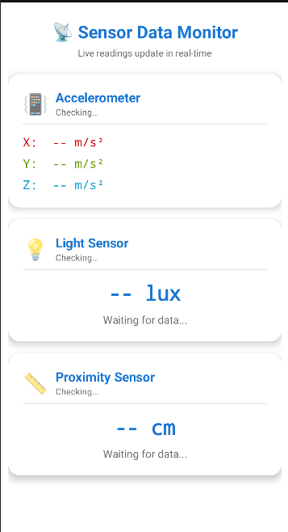
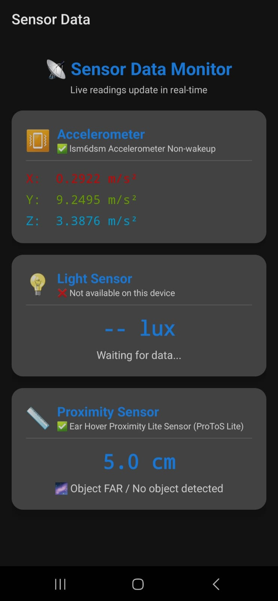

# Q2 — Media Player App

## About
This is my second Android project for the Mobile Application Development assignment (CSE3709). In this one I had to build a media player that can play audio files from the phone storage and also stream a video from the internet using a URL. All the buttons like Open File, Open URL, Play, Pause, Stop and Restart had to be there.

---

## Screenshots

### App Layout


### Final App Output


---

## What I Made

The app has one single screen with everything on it. There are two open buttons at the top — one for picking an audio file from the phone and one for entering a video URL. Below that there are four playback buttons — Play, Pause, Stop, Restart. A status label in the middle tells you what is happening right now like "Playing audio" or "Video ready — Press Play".

For audio there is also a SeekBar that shows how much of the song has played and you can drag it to jump to any part.

For video, a VideoView takes up the top part of the screen and a built in MediaController appears when you tap on the video so you can also control it from there.

---

## What I Used

- Java (Android)
- XML for layout
- MediaPlayer class — for playing audio files from device storage
- VideoView — for streaming video from a URL
- MediaController — gives the built in video controls that appear on tap
- SeekBar — to show audio progress and allow seeking
- Handler and Runnable — to update the SeekBar every 500ms while audio plays
- AlertDialog — for the URL input popup when user taps Open URL
- Intent with ACTION_GET_CONTENT — to open the system file picker for audio
- INTERNET permission in manifest — needed for video streaming
- usesCleartextTraffic flag — needed for http links during testing

---

## How It Works

**For Audio:**
1. Tap Open File
2. Phone's file picker opens — select any mp3 or audio file
3. MediaPlayer loads it using prepareAsync so the UI does not freeze
4. When ready, status changes to "Audio ready — Press Play"
5. Press Play — audio starts, SeekBar begins moving
6. Pause freezes it at current position, Stop rewinds to start, Restart plays from beginning

**For Video:**
1. Tap Open URL
2. A dialog box opens where you type or paste a direct video link like an mp4 URL
3. VideoView loads and buffers the video
4. Press Play — video starts streaming
5. Tapping on the video shows built in controls from MediaController

---

## Problems I Faced and How I Solved Them

### MediaPlayer crashing after pressing Stop then Play again
This was the first big error I got. When I pressed Stop and then Play again the app was crashing with an IllegalStateException. I searched and found out that after calling stop() on MediaPlayer you cannot directly call start() again. You have to call prepare() first to reset it to a ready state. So I added mediaPlayer.prepare() inside my stop method right after stop() and then seekTo(0) to go back to the beginning. After that it worked fine.

### Video not loading — no internet even though internet is there
I added the video URL and pressed load but the VideoView was just showing a black screen and nothing was happening. The status was showing error. I checked the manifest and I had not added the INTERNET permission at all. Added it and the video started loading. But then for http links it was still not working because newer Android versions block unencrypted traffic by default. I added android:usesCleartextTraffic="true" in the application tag in the manifest and that fixed it for http URLs. For https links this flag is not needed.

### SeekBar was not moving while audio played
The SeekBar was just sitting at zero even when the audio was playing. I thought there was something wrong with my setMax or setProgress calls. The actual problem was I was setting the progress once and forgetting about it. I had to keep updating it continuously while the audio is playing. I used a Handler with a Runnable that runs every 500 milliseconds and updates the SeekBar with mediaPlayer.getCurrentPosition(). I also made sure to stop this handler when the audio is paused or stopped so it does not keep running unnecessarily.

### File picker was showing all files not just audio
When I tapped Open File the picker was showing every type of file including documents, images, videos. I wanted only audio files. The fix was simple — I just had to change the intent type from the default to "audio/*" and it started filtering and showing only audio files.

### App crashing when Play pressed without loading any media
If the user opens the app and directly presses Play without loading anything first, the app was crashing because mediaPlayer was null. I added a simple check — if currentMode is empty meaning no file has been loaded yet, just show a Toast message saying "No media loaded. Use Open File or Open URL first." instead of trying to call play on a null object.

### Audio continuing to play when app goes to background
When I pressed the home button while audio was playing it kept playing in the background. For this assignment it made more sense to pause when the app is not visible. I added a pause call inside onPause() of the activity so whenever the app goes to background or the screen turns off the audio pauses automatically.

### MediaPlayer not released properly
I realized that if I opened a new audio file without releasing the previous MediaPlayer first, memory would keep building up. I created a releaseMediaPlayer() helper method that checks if mediaPlayer is not null, stops it if playing, calls release(), and sets it to null. I call this every time before creating a new MediaPlayer instance.

---

## Project Structure

```
MediaPlayer/
└── app/
    └── src/
        └── main/
            ├── java/com/example/mediaplayer/
            │   └── MainActivity.java     ← All logic here
            │
            ├── res/
            │   ├── layout/
            │   │   └── activity_main.xml
            │   └── values/
            │       ├── themes.xml
            │       ├── colors.xml
            │       └── strings.xml
            │
            └── AndroidManifest.xml
```

---

## Permissions Used

| Permission | Why |
|---|---|
| INTERNET | Required to stream video from a URL |
| READ_EXTERNAL_STORAGE | To read audio files from device storage on Android 12 and below |
| READ_MEDIA_AUDIO | To read audio files on Android 13 and above |
| READ_MEDIA_VIDEO | To read video files on Android 13 and above |

---

## Test Video URL I Used

During development I tested with this free sample video:
```
https://www.w3schools.com/html/mov_bbb.mp4
```
This URL is pre-filled in the dialog so the teacher can test it easily without typing anything.

---

## Conclusion

This project taught me how MediaPlayer works in Android and why its lifecycle is so important. Before this I did not know that stop() and pause() are different in terms of what state the player goes into and what you need to do before playing again. The SeekBar update using Handler was also something new I learned. VideoView was much easier to use than I expected because most of the work is already done by Android — you just give it a URI and it handles buffering and playback. Overall this was a fun project to build and test.

---

## Author

**Roushan Kumar Singh**
B.Tech CSE | Batch 2024–28
Subject: Mobile Application Development (CSE3709)
Even Semester 2026
