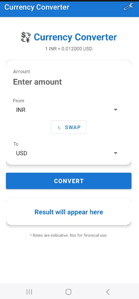
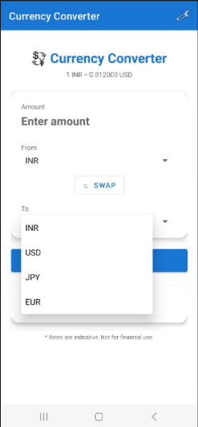
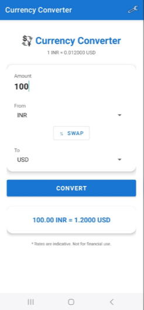
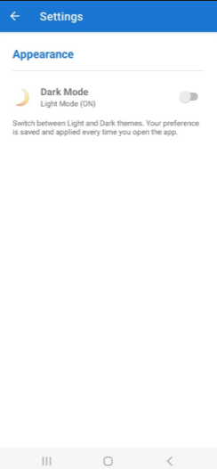

#  Currency Converter App

This is a simple Android application developed for my Mobile Application Development (MAD) assignment (CSE3709), Even Semester 2026.

The app allows users to convert currency values between INR, USD, EUR, and JPY using predefined exchange rates. It also includes a Settings screen to toggle between Light and Dark themes.

---

##  Features

* Convert between INR, USD, EUR, JPY
* Clean and simple user interface
* Real-time exchange rate display (updates on currency selection)
* Swap button to quickly reverse From/To currencies
* Settings screen with Dark Mode toggle
* Theme preference saved across app restarts (SharedPreferences)
* Card-based professional UI design
* Smooth button interactions

---

##  Screenshots

### Home Screen


### Dropdown / Currency Selection


### Conversion Result


### Settings Screen (Dark Mode)


---

##  Technologies Used

* Java (Android)
* XML (UI Design)
* Material Components (CardView, DayNight Theme)
* SharedPreferences (theme persistence)
* AppCompatDelegate (Light/Dark theme switching)
* Android Studio
* Git & GitHub

---

##  How the App Works

1. User enters an amount in the input field
2. Selects **From Currency** (INR / USD / EUR / JPY)
3. Selects **To Currency** (INR / USD / EUR / JPY)
4. Optionally taps **⇅ Swap** to reverse the currencies
5. Taps **Convert** — result is displayed instantly
6. Live rate (e.g., `1 INR = 0.012000 USD`) is always shown below the title

---

##  Conversion Logic

All conversions are done via INR as the base currency:

```
result = (amount / rateOfFromCurrency) × rateOfToCurrency
```

Exchange rates used (approximate, static):

| Currency | Rate (1 INR =) |
|----------|---------------|
| INR      | 1.0           |
| USD      | 0.012         |
| JPY      | 1.81          |
| EUR      | 0.011         |

---

##  Dark Mode / Settings

- Open **Settings** via the gear icon (⚙️) in the top toolbar
- Toggle the **Dark Mode** switch
- Theme is applied **instantly** using `AppCompatDelegate.setDefaultNightMode()`
- Preference is saved with `SharedPreferences` so the theme persists when the app is reopened

---

##  Project Structure

```
CurrencyConverter/
│
├── app/
│   └── src/
│       └── main/
│           ├── java/com/example/currencyconverter/
│           │   ├── MainActivity.java        ← Conversion logic + UI
│           │   └── SettingsActivity.java    ← Dark/Light theme toggle
│           │
│           ├── res/
│           │   ├── layout/
│           │   │   ├── activity_main.xml     ← Main converter screen
│           │   │   └── activity_settings.xml ← Settings screen
│           │   ├── menu/
│           │   │   └── main_menu.xml         ← Toolbar Settings icon
│           │   ├── drawable/
│           │   │   └── button_bg.xml         ← Custom button background
│           │   └── values/
│           │       ├── themes.xml            ← DayNight Material theme
│           │       ├── colors.xml
│           │       └── strings.xml
│           │
│           └── AndroidManifest.xml
│
├── screenshots/
│   ├── result1.png   ← Home screen
│   ├── result2.png   ← Dropdown / currency selection
│   ├── result3.png   ← Settings screen (Dark Mode)
│   └── result4.png   ← Conversion result
│
└── README.md
```

---

##  Problems Faced & Solutions

###  App not running (MainActivity error)
Fixed by correcting the manifest declarations and rebuilding the project.

---

###  Spinner not showing currencies
Solved by setting up `ArrayAdapter` with the currency list and assigning it to both spinners.

---

###  Long decimal values in output
Formatted using:
```java
String.format("%.4f", result);  // 4 decimals for most currencies
String.format("%.0f", result);  // 0 decimals for JPY
```

---

###  Text not visible in dark background
Fixed by using `?android:attr/textColorSecondary` and `?attr/colorPrimary` — these adapt automatically to the active theme.

---

###  Theme not persisting after app restart
Solved by saving the dark mode boolean in `SharedPreferences` and calling `applyThemeFromPrefs()` before `super.onCreate()` in `MainActivity`.

---

###  Screenshots not visible on GitHub
Fixed by adding image files using Git and correcting the relative paths in the README.

---

###  UI looked too basic
Improved with:
- `CardView` for the input and result sections
- Material Components DayNight theme
- Custom `button_bg.xml` drawable
- Proper spacing, padding, and typography

---

##  Conclusion

This project helped me understand Android development basics including:
- Activity lifecycle and navigation
- UI design with XML layouts and Material Components
- User input handling with Spinners and EditText
- Theme management with AppCompatDelegate
- Data persistence with SharedPreferences
- Debugging common Android errors
- GitHub project management and README documentation

---

##  Author

**Roushan Kumar Singh**
BTech CSE | Batch 2024–28
Subject: Mobile Application Development (CSE8)


